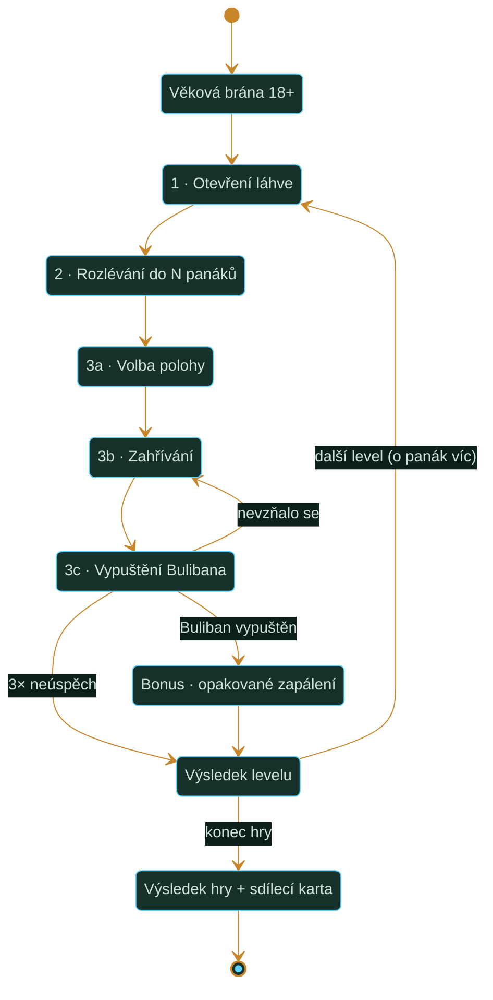

# Buliban – minihra: herní design dokument

**Verze:** 0.2
**Datum:** 16. 8. 2026
**Platforma:** web (Astro), desktop i mobil rovnocenně
**Pracovní název:** *Vypusť Bulibana!*

> 🔧 = ladicí konstanta, patří do jednoho konfiguračního souboru a doostří se playtestem.
> ❓ = otevřená otázka k potvrzení (souhrn v kap. 12).
> ⚠️ = předpoklad, který jsem si domyslel.
>
> **Změny oproti v0.1:** přepsané jádro fáze 2 – panáky místo velkých skleniček, jedno nalití na skleničku bez možnosti dolévat, náhodný objem v láhvi. Vypuštěny implementační detaily (nasazení, struktura kódu, datové modely) – web poběží na Astro, technický blueprint doplním, až bude mechanika potvrzená.

---

## 1. Vize a rámec

Minihra je herní převyprávění rituálu Buliban tak, jak ho popisuje web: láhev se nejdřív musí **rozlít mezi lidi u stolu** a teprve **prázdná láhev** se zahřívá a zapaluje. Herní smyčka kopíruje sled rituálu a dává hráči jednu dovednost, kterou lze zlepšovat: **odměřit od oka stejný díl pro všechny, napoprvé a bez opravy.**

**Herní fantazie:** „Jsem ten, kdo u stolu nalévá – a nikdo si nestěžuje, že má míň."

**Tři pilíře:**

1. **Odhad místo reflexů.** Skóre neplyne z rychlosti, ale z toho, jestli hráč správně odhadl, kolik je v láhvi, vydělil to počtem panáků a trefil to.
2. **Neodvolatelnost.** Do panáku se lije jednou. Chyba se nedá dorovnat, jen kompenzovat v tom, co zbývá. Tohle je hlavní zdroj napětí.
3. **Rituál jako brána.** Zahřátí a zážeh nejsou minihra navíc – bez vypuštění Bulibana se nepostupuje dál.

**Co hra NENÍ:** není to návod ani simulace reálného postupu. Fyzika je stylizovaná, teplota je v abstraktních „jednotkách zahřátí", ne ve °C, a nikde nezazní reálné časy, množství ani postupy (kap. 11).

**Délka:** jeden level 30–60 s. Celkový počet úrovní zatím není stanovený ❓ (rozhodne se po testování); při osmi úrovních vychází průchod na zhruba 5–6 minut.

---

## 2. Herní smyčka

**Jeden level = jedna láhev = N panáků = jeden rituál.**



**Rozložení bodů (záměrné):**

| Fáze | Podíl | Role |
|---|---|---|
| 1 – Otevření láhve | ~10 % | rozehřívací, odměna za svižnost |
| 2 – Rozlévání | ~50 % | **jádro hry** |
| 3 – Zahřátí a zážeh | ~40 % | brána do dalšího levelu, risk/reward |

---

## 3. Fáze 1 – Otevření láhve

Krátká, svižná, nelze ji prohrát – jen být pomalý.

### 3.1 Sundání pečeti
Staniolová pečeť kolem hrdla, hráč ji sedře krouživým tahem (myš/prst) nebo opakovaným stiskem mezerníku. Čas při plynulém tahu 🔧 ~1,2 s. Body 0, ale počítá se do času fáze.

### 3.2 Vytažení korku
Timing bar: ukazatel putuje po liště tam a zpět, uprostřed zelené pásmo se zúženým „perfect" jádrem. **Tři úspěšné zásahy** = korek venku.

| Zásah | Efekt | Body |
|---|---|---|
| Perfect | korek povyjede o 50 % | 🔧 60 |
| Zelená | korek povyjede o 33 % | 🔧 40 |
| Mimo | zasekne se, prodleva 0,5 s, zvuk „vrz" | 0 |

Škálování: rychlost ukazatele `1,0 + 0,12 × (level − 1)` 🔧, šířka zeleného pásma `0,26 − 0,015 × (level − 1)` 🔧 (min. 0,14).

**Bonus za svižnost:** `max(0, round((4,0 − t) × 25))` 🔧, tedy do ~100 bodů.
**Strop fáze 1:** ~280 bodů – záměrně drobné.

---

## 4. Fáze 2 – Rozlévání (jádro hry)

### 4.1 Základní pravidlo

Na stole je **N panáků** (`N = level + 1`, level 1 = 2 panáky). Láhev obsahuje **náhodné množství rumu**, které se vždy celé vejde do panáků na stole. Hráč musí obsah rozdělit tak, aby ve všech panácích bylo stejně.

**Železná pravidla:**

- Do každého panáku se lije **právě jednou**.
- Po puštění tlačítka se láhev **automaticky přesune** nad další panák. Hráč cíl nevybírá.
- **Není návrat.** Do panáku, kde už něco je, se nedá dolít.
- Do posledního panáku se **automaticky dolije celý zbytek láhve** – barman v láhvi nenechá nic.

To poslední pravidlo je celý vtip hry: hráč fakticky rozhoduje jen o prvních N−1 panácích a **poslední panák je zúčtování**. Kolik do něj přiteče, není hráčova volba – je to výsledek toho, jak dobře odhadl celkový objem. Napětí posledního nalití nese celý level.

### 4.2 Co dělá hru těžkou

Hráči nikde nesvítí cílové číslo. Musí ho odvodit ze tří věcí, z nichž každá je zdrojem chyby:

1. **Odhad objemu v láhvi.** Hladinu hráč vidí, ale **tvar láhve mu lže**. Jen u dokonalého válce platí, že polovina výšky je polovina objemu; jakmile má láhev rameno, břicho nebo se kónicky zužuje, přestává to platit. Tohle je hlavní intelektuální překážka hry a zároveň samostatná osa progrese – viz katalog tvarů níže.
2. **Dělení počtem panáků.** Triviální u dvou, netriviální u devíti.
3. **Provedení nalití.** Proud má náběh, bublá a po puštění **dokape** (kap. 4.4).

Sekundární pomůcka, kterou hráč získá zdarma: **předchozí nalité panáky zůstávají na stole** a dá se s nimi vizuálně porovnávat. Ale pozor – kopírovat první panák nestačí. Kdyby hráč lil konzistentně, ale špatný objem, poslední panák to odhalí. Musí trefit *správný* díl, ne jen být konzistentní.

#### Katalog tvarů lahví

Tvar je **druhá osa obtížnosti**, nezávislá na počtu panáků. Ve všech úrovních kromě finále je vidět, kolik je v láhvi tekutiny – co se mění, je jak snadno se z výšky hladiny odvodí objem.

| Tvar | Popis | Vztah výška ↔ objem | Obtížnost |
|---|---|---|---|
| **A** | válec – stejný průměr po celé výšce, úzké hrdlo | lineární, dokud hladina nedosáhne hrdla | výchozí |
| **B** | klasická láhev s ramenem | lineární v těle, prudký zlom v rameni | nízká |
| **C** | kónická / klínovitá, zužuje se vzhůru | `dV/dh` klesá s výškou – nahoře je „míň, než to vypadá" | střední |
| **D** | břichatá, vypouklá uprostřed | `dV/dh` má maximum uprostřed – hladina v polovině výšky je **nad** polovinou objemu | vysoká |
| **E** | dvojitě vypouklá / karafa | nemonotónní průběh, dvě protichůdné intuice v jedné láhvi | nejvyšší |
| **F** | **částečně průhledná** | hladina je částečně skrytá etiketou, nebo je špatně vidět kvůli hůře průhledné lahvi | semifinále |
| **G** | **neprůhledná** | hladina není vidět vůbec | finále |

**Pravidlo zavádění:** složitější tvary se objeví ve vyšších levelech, kde před tím rozléval do více panáků. Složitost levelu se stále zvyšuje. Nový tvar v každém levelu dělá loterii – sle hráč si pro každý tvar vybuduje postupně převodní intuici a pak ji v dalším průchodu hrou použije.

#### Poloprůhledná a neprůhledná láhev jako semifinále a finále

Poslední úrovně jsou záměrně **slepé**: hladina není vidět jasně nebo vůbec a rozlití se dá zvládnout hlavně se štěstím. Je to pointa hry, pro její konečnost a dohrání, ne standardní level – ať to zůstane krátké, jednorázové a zapamatovatelné.

Tři poznámky, aby to nebyl čistý hod kostkou:

- Nechat v platnosti **sluchová vodítka**: frekvence plnění panáku stoupá s hladinou, bublání láhve se mění, jak se vyprazdňuje. Kdo hrál předchozí levely se zapnutým zvukem, má reálnou výhodu – a to je poctivá odměna za pozornost, ne berlička.
- **Rozvolnit `CV_max`** pro tento level (návrh: dvojnásobek běžné tolerance 🔧). Se stejnou přísností jako u průhledné láhve by medaile byla čistě náhodná a hráč by neměl důvod to opakovat.
- Odměnit ji **vlastním titulem nebo odznakem**, ne jen body. Slepé finále je historka, kterou si člověk pamatuje; skóre není.

> [!WARNING]
> **Otevřená otázka:** celkový počet úrovní zatím není stanovený – rozhodne se po testování. Do té doby je „finále" v tabulkách vedené jako poslední level bez konkrétního čísla. Pokud hráč trefí naslepo i poslední level, bude takto množné pokračovat do nekonečna, ale pravděpodobnost hráče stejně velmi brzo dožene a hra skončí. Předpoklad je že bude cca 10 normálních levelů.

### 4.3 Ovládání

Jedno tlačítko. Nic víc.

| Platforma | Nalévání |
|---|---|
| Desktop – myš | držení levého tlačítka kdekoli ve scéně |
| Desktop – klávesnice | držení mezerníku |
| Mobil / dotyk | držení prstu kdekoli ve scéně |

Držím = teče. Pustím = přestane téct (s doběhem) a láhev se po 🔧 0,4 s přesune nad další panák. Nelze pauzírovat a pokračovat do stejného panáku – puštění je konečné. Animace otočení lahve při nalévání.

Tohle je hlavní důvod, proč hra funguje na mobilu i desktopu bez kompromisu: gesto je identické.

### 4.4 Model průtoku

Šum musí být **čitelný a naučitelný**, ne nespravedlivý.

```
tilt(t)  = easeOutCubic( min(holdTime / 0,30 , 1) )        // náběh proudu
fill     = zbytekMl / kapacitaLahve
gravity  = 0,55 + 0,45 × sqrt(fill)                         // prázdná láhev teče hůř
glug     = 1 + A × sin(2π × t / T + φ) + rng(−0,03; 0,03)   // bublání
flow     = FLOW_MAX × tilt(t) × gravity × glug              // ml/s
```

| Konstanta | Hodnota | Poznámka |
|---|---|---|
| `FLOW_MAX` | 🔧 22 ml/s na L1, roste na 30 ml/s na L8 | plný proud; 40ml panák se naplní za ~1,8 s |
| náběh | 🔧 0,30 s | |
| doběh po puštění | 🔧 0,15 s, dokape 🔧 1,5–3 ml | **hlavní zdroj chyby začátečníka** |
| `T` (perioda bublání) | 🔧 0,45 s | |
| `A` (amplituda) | 🔧 0,05 → 0,12 podle levelu | |
| `φ` | náhodná fáze každého nalití | ze seedovaného generátoru |

Dokapání musí být vizuálně i zvukově zřetelné – je to to, co se hráč učí předvídat, a tedy hlavní osa zlepšování.

### 4.5 Co hráč vidí a nevidí

| Informace | Zobrazená? | Proč |
|---|---|---|
| Hladina v panácích | ✅ | to je celá hra |
| Objem v ml | ❌ | zabilo by to odhad |
| Hladina v láhvi | ✅ ve všech levelech kromě finále | odhad objemu je záměrná překážka; ve finále je láhev neprůhledná |
| Cílový objem | ❌ (výjimka: ryska v levelu 1 jako tutoriál) | |
| Kolik panáků zbývá | ✅ | plánování je legitimní součást hry |
| Přesná čísla a odchylky | ✅ až ve výsledku levelu | tam už je to odměna, ne pomůcka |

**Signature prvek – „linka rovnosti":** ve výsledku levelu se přes všechny panáky přetáhne jedna tenká svítící vodorovná linka na úrovni **průměru** a u každého panáku se rozsvítí odchylka nad/pod ní. Funkční vysvětlení skóre i nejzapamatovatelnější vizuální gesto hry.

### 4.6 Tabulka levelů

Panák má kapacitu 🔧 **40 ml**. Cílový díl je náhodný z intervalu 🔧 **10–40 ml**, aby se vešel i s chybou. Objem láhve `V = N × cíl`. Velikost láhve roste s levelem tak, aby hladina byla vždy v dobře čitelné části (20–90% výšky).

| Level | N panáků | Cíl / panák | Objem v láhvi | Láhev · tvar | `CV_max` | `A` | Modifikátor | Základ bodů |
|---|---|---|---|---|---|---|---|---|
| 1 | 2 | 10–40 ml | 20–80 ml | 0,5 l · **A** | 0,100 | 0,05 | ryska (tutoriál) | 800 |
| 2 | 3 | 10–40 ml | 30–120 ml | 0,5 l · A | 0,095 | 0,06 | – | 1 200 |
| 3 | 4 | 10–40 ml | 40–160 ml | 0,5 l · **B** | 0,090 | 0,07 | – | 1 600 |
| 4 | 5 | 10–40 ml | 50–200 ml | 0,5 l · B | 0,085 | 0,08 | – | 2 000 |
| 5 | 6 | 10–40 ml | 60–240 ml | 0,5 l · **C** | 0,080 | 0,09 | – | 2 400 |
| 6 | 7 | 10–40 ml | 70–280 ml | 0,5 l · C | 0,075 | 0,10 | **host si panák odnese** | 2 800 |
| 7 | 8 | 10–40 ml | 80–320 ml | 0,5 l · **D** | 0,070 | 0,11 | – | 3 200 |
| 8 | 9 | 10–40 ml | 90–360 ml | 0,5 l · D | 0,065 | 0,12 | – | 3 600 |
| 9 | 10 | 10–40 ml | 90–400 ml | 0,7 l · **E** | 0,060 | 0,12 | – | 4 000 |
| 10 | 11 | 10–40 ml | 90–440 ml | 0,7 l · E | 0,055 | 0,13 | – | 4 400 |
| 11+ | level+1, max 12 | 10–40 ml | N × cíl | 0,7 l · **F částečně průhledná** | 0,050 | 0,14 | vše výše | 400 × N |
| **finále**  | dle rozhodnutí | 10–40 ml | N × cíl | 0,7 l · **F neprůhledná** | 🔧 2× běžná | 0,15 | slepé rozlévání | 🔧 dvojnásobek |

Tučně vyznačený tvar = v tom levelu se zavádí poprvé, v následujícím se opakuje.

**Modifikátory obtížnosti – proč zrovna tyhle:**

| Modifikátor | Od | Co dělá | Proč to bolí |
|---|---|---|---|
| **Host si panák odnese** | L6 | nalitý panák zmizí ze stolu | hráč přijde o vizuální referenci a zbývá mu jen paměť a hladina v láhvi – nejtvrdší skok obtížnosti v celé hře |
| **Slepá láhev** | finále | hladina není vidět | vyřadí první článek celého řetězce odhadu; zbývají jen sluchová vodítka |

### 4.7 Bodování fáze 2

```
mean = Σ Vᵢ / N
σ    = sqrt( Σ (Vᵢ − mean)² / N )      // populační směrodatná odchylka
CV   = σ / mean                        // variační koeficient
E    = clamp(1 − CV / CV_max , 0 , 1)  // 1 = dokonalé, 0 = mimo toleranci
```

| Složka | Vzorec | Poznámka |
|---|---|---|
| **Rovnoměrnost** | `round(base × E^1,5)` | 100 % odměny při `CV = 0` 🔧 |
| Bonus za čas | `max(0, round((t_ref − t) × 15))`, `t_ref = 6 + 3N` s 🔧 | malý, ať nenutí spěchat |
| Přelití panáku | `−150` za událost 🔧, přebytek se rozlije a mizí | |
| Rozlití vedle | `−3 × rozlito_ml` 🔧 | |
| Bonus „Přesná ruka" | `CV ≤ 0,015` → `+500` a **×1,2 na celý level** 🔧 | vzácný, ať je co honit |

**Medaile levelu** (podíl na teoretickém maximu):

| Medaile | Práh | ~odpovídá `CV` na L3 |
|---|---|---|
| 🥇 Zlatý Buliban | ≥ 90 % | ≲ 0,020 |
| 🥈 Stříbrný | ≥ 75 % | ≲ 0,035 |
| 🥉 Bronzový | ≥ 55 % | ≲ 0,050 |
| – | < 55 % | level se přesto dokončí |

**Kalibrace pro playtest:** medián `CV` nového hráče na L1 ≈ 0,06; podíl zlatých medailí u nováčka ≤ 10 %, u zkušeného hráče 40–60 %.

### 4.8 Prohra

Fáze 2 **nejde prohrát**, jde jen získat málo bodů. Pro minihru na webu je tvrdý fail state zbytečná bariéra – hráč má odejít s „příště líp", ne s „tohle nejde".

---

## 5. Fáze 3 – Zahřátí a vypuštění Bulibana

Láhev je prázdná. Podle webu právě teď začíná rituál. Tohle je brána do dalšího levelu a jediné místo ve hře s časovým stresem.

### 5.1 Krok A – Volba polohy

| Poloha | Cílové pásmo | Násobitel | Efekt |
|---|---|---|---|
| **Vertikální** (dnem dolů) | užší (−6 jednotek) | ×1,3 | krátký soustředěný modrý zážeh u hrdla, sestupuje ke dnu, hlasitější |
| **Horizontální** (na boku) | širší (+6 jednotek) | ×1,0 | delší rozptýlený plamen po délce láhve, vizuálně bohatší |

Risk/reward rozhodnutí, které zároveň učí hráče lore webu.

### 5.2 Krok B – Zahřívání

Ukazatel **0–100 „jednotek zahřátí"** (stylizovaná škála, nikoli °C – viz kap. 11) s vyznačeným cílovým pásmem. Hráč vybere metodu a drží tlačítko.

| Metoda | Rychlost (j/s) | Setrvačnost po puštění | Chladnutí (j/s) | Zvláštnost | Násobitel |
|---|---|---|---|---|---|
| Tření v dlaních | 🔧 4 | +1 | 1,5 | tradiční, bez rizika | **×1,25** |
| Tření o kolena | 🔧 5 | +1 | 1,5 | bez rizika | ×1,20 |
| Zahřívání přes oděv | 🔧 2,5 | +0,5 | 1,0 | **strop 55 j** – samo nedohřeje | ×1,15 |
| Teplý ručník | 🔧 3,5 | +2 | 0,8 | drží teplo nejdéle | ×1,10 |
| Fén | 🔧 9 | +3 | 2,0 | hlučný, mírné přestřelení | ×1,00 |
| Teplá voda | 🔧 12 | +5 | 2,5 | rychlé a rovnoměrné, snadno přestřelí | ×0,95 |
| Nad plamenem | 🔧 20 | +9 | 3,5 | **nad 95 j praskne sklo** → 0 bodů za zážeh | ×0,85 |

Násobitel odměňuje pomalé a tradiční metody, riziko odměňuje rychlé. Kdo spěchá, hraje o body. „Zahřívání přes oděv" má strop schválně – nutí kombinovat metody, což web taky popisuje.

**Odemykání:** level 1 nabízí tři metody (dlaně, oděv, teplá voda), každý další level odemkne jednu. Dává důvod hrát dál.

### 5.3 Krok C – Vypuštění (časový stres)

Po puštění zahřívání teplota **klesá**. Běží čas.

1. **Sundat uzávěr** – jeden klik, animace 🔧 0,4 s.
2. **Vybrat oheň:**
   - **Zápalka** – nutno škrtnout (jeden timing klik), hoří 🔧 4 s, může zhasnout průvanem (🔧 12 %), ale dává **+15 % bodů za zážeh** (tradice).
   - **Zapalovač** – okamžitý, 🔧 15 % šance, že nechytne napoprvé (prodleva 0,6 s), bez bonusu.
3. **Přiblížit plamen k hrdlu a ČEKAT.** Hráč drží. Zážeh přijde po náhodné prodlevě 🔧 0,5–2,0 s. Kdykoli může ucuknout – bezpečně, ale bez bodů. To napětí je celý smysl kroku.

**Vyhodnocení v okamžiku zážehu:**

```
Q = clamp( 1 − |teplota − střed_pásma| / (šířka_pásma / 2) , 0 , 1 )

bodyZážeh = round( 700 × Q × poloha × metoda × zápalka × (1 − 0,25 × (pokus − 1)) )
```

Teplota mimo pásmo → **nic se nestane**, plamen dohoří, hláška „ticho po pěšině". `Q` řídí výšku, barvu a délku plamene – od nesměle modrého po dlouhý modrožlutý.

**Pokusy:** 3 na level. Po úspěchu se hráč posouvá na další Level. Po neúspěchu se lze vrátit na zahřívání, teplota si drží část hodnoty (odpovídá „opakovanému zapálení" na webu). Po třetím neúspěchu level skončí bez bodů za zážeh a **hra končí**.

## 6. Progrese, meta a sdílení

**Struktura:** posloupnost levelů se stoupajícím `N` a stoupající obtížností tvaru láhve, zakončená slepým finále s neprůhlednou lahví. Celkový počet úrovní cca 12. Nekonečný režim (`N` roste po 1, strop 12 panáků).

**Tituly podle celkového skóre:**

| Titul | Práh 🔧 |
|---|---|
| Nováček u stolu | 0 |
| Nalévač | 4 000 |
| Bulibanista | 10 000 |
| Strážce plamene | 18 000 |
| Velký Bulibán | 28 000 |

**Sdílecí karta** (PNG 1080×1350): titul, celkové skóre, nejlepší `CV`, dosažený level, malý „otisk" – siluety panáků s finálními hladinami (každý běh vypadá jinak), `#buliban` + `buliban.cz`. Tlačítka Stáhnout / Sdílet / Zkopírovat odkaz.

---

## 7. Vizuální směr

**Koncept: „Pohled skrz láhev."** Scéna má barevnost tmavého skla – ne generická černá herní obrazovka, ale zelenošedá hloubka, ve které je jantarový rum jediné teplé místo. Veškerá modrá je rezervovaná **výhradně pro okamžik zážehu**, takže když se poprvé objeví, má váhu.

### 7.1 Barevné tokeny

| Token | Hex | Použití |
|---|---|---|
| `--sklo-hluboke` | `#0D1F1A` | pozadí scény |
| `--sklo-stin` | `#16302A` | panely, karty |
| `--rum` | `#C8862B` | kapalina, primární akcent |
| `--rum-svetlo` | `#E8B25C` | hladina, odlesky |
| `--par-mint` | `#CFE3D8` | text, obrysy skla |
| `--zazeh` | `#5BD1FF` | **jen** plamen a „linka rovnosti" |
| `--zhava` | `#FF6B35` | varování, přehřátí |

Vědomě se vyhýbám krémovému pozadí se serifem a terakotou i schématu „černá plus jedna křiklavá barva" – první je dnes vizuální klišé, druhé by zabilo dopad modrého zážehu.

### 7.2 Typografie

| Role | Návrh | Proč |
|---|---|---|
| Display (nadpisy, skóre) | **Fraunces** (variable, osa „wonk") | měkce nepravidelná, působí ručně a rituálně |
| Body / UI | **Instrument Sans** | čistá, úzká, nenápadná |
| Číselný HUD (objemy, odchylky) | **JetBrains Mono** | tabulkové číslice – měřicí přístroj, ne marketing |

⚠️ **Ověřit podporu české diakritiky** u všech tří (zejména `ř`, `ě`, `ů`, `ď`). Nemám to ověřené z primárního zdroje.

### 7.3 Ilustrace a animace

- Vše **vektorově** – láhev, panáky, stůl, ikony. Ostré v každém rozlišení, malý objem dat.
- Láhev rumu: animovaná při nalévání 
- Kapalina: animovaná hladina + jemné vlnění po nalití (dvě tlumené sinusoidy).
- Plamen a jiskry: částicová vrstva nad scénou, 🔧 max 200 částic.
- **Rozpočet efektů:** veškerá odvaha se utrácí na dvou místech – „linka rovnosti" ve výsledku a zážeh. Všechno ostatní zůstává klidné.
- Při `prefers-reduced-motion`: bez částic, vlnění a otřesů; zážeh nahradit statickým zábleskem.

### 7.4 Zvuk

| Událost | Zvuk |
|---|---|
| Nalévání | šum přes band-pass, jehož **frekvence stoupá s hladinou v panáku** – hráč slyší, jak se plní |
| Bublání | krátké pulzy synchronizované s funkcí `glug` |
| Dokapání | tři tiché kapky |
| Přelití | tříštivý „šplouch" |
| Korek | „plop" |
| Přesun nad další panák | tiché cinknutí skla |
| Zážeh | krátké „whoosh" + doznívající dutá rezonance láhve |

Zvuk je **vypnutý ve výchozím stavu** (autoplay politika + někdo to hraje v práci), přepínač viditelně v HUD.

---

## 8. Obrazovky

| # | Obrazovka | Obsah |
|---|---|---|
| 1 | Uvítání | název, „Jak se hraje" ve třech ikonách, Hrát / Trénink, přepínač zvuku |
| 2 | Věková brána | „Je ti 18 nebo víc?" Ano / Ne. Ne → zpět na web |
| 3 | Herní scéna | horní lišta (level, skóre, `panák k/N`, zvuk, pauza), stůl s panáky, láhev, spodní nápověda |
| 4 | Výsledek levelu | „linka rovnosti", odchylky, rozpad bodů, medaile, Pokračovat |
| 5 | Rituál – zahřívání | volba polohy, dlaždice metod, teploměr, tlačítko zahřívat |
| 6 | Rituál – vypuštění | ukazatel chladnutí, uzávěr, volba ohně, „drž a čekej" |
| 7 | Konec běhu | titul, celkové skóre, tabulka levelů, sdílecí karta, Hrát znovu |

**Tón mikrotextů** – aktivní, věcný, bez omluv:
`Drž a nalévej` · `Zbývají dva panáky` · `Do tohohle už nedolijeme` · `Rozlito – to už do panáku nedostaneš` · `Ticho po pěšině. Láhev byla vlažná.` · `Buliban vypuštěn.`

---

## 9. Technické principy, které ovlivňují design

Jen to, co má dopad na herní pocit – detailní blueprint doplním po potvrzení mechaniky.

- **Pevný krok simulace (60 Hz)** oddělený od vykreslování. Bez toho by hráč na 144Hz monitoru naléval jinak než na 60Hz – u hry o přesnosti dávkování je to zabiják.
- **Seedovaný generátor náhody.** Objem v láhvi, fáze bublání i prodleva zážehu jdou ze seedu, takže je možná denní výzva se stejnými podmínkami pro všechny a reprodukce chyb.
- **Simulace nalévání jako čistá funkce** – testovatelná bez UI a laditelná bez klikání.
- **Debug panel** (`?debug=1`): přesné objemy, `CV` v reálném čase, přepínač levelu, vypnutí šumu, zpomalení času, ruční seed. **Postavit jako první věc** – bez něj se hra nedá vyladit.
- **Pauza při přepnutí záložky** – jinak se láhev rozlije na pozadí.
- Ukládání postupu lokálně v prohlížeči, se schématem a migrací. Online žebříček je otázka ❓, ne nutnost pro první verzi.

---

## 10. Přístupnost a rozsah

- Plné ovládání klávesnicí (mezerník, Enter, Esc).
- Hlasové oznamování stavu pro odečítače: „panák 3 ze 4, přibližně tři čtvrtiny".
- Žádná informace jen barvou – odchylka i tvarem a číslem.
- Kontrast textu ≥ 4,5:1, viditelný focus.
- Cíl 60 fps na čtyři roky starém středním Androidu; hra se načítá až když je vidět.
- Čeština primárně, angličtina jako volitelná vrstva – texty držet od začátku na jednom místě.

---

## 11. Právní a bezpečnostní rámec

1. **Věková brána 18+** na začátku. Téma je alkohol; česká úprava reklamy na alkoholické nápoje (zejména zákon č. 40/1995 Sb. o regulaci reklamy) obsahuje omezení mířená na nezletilé. Brána je levná a odstraní většinu rizika.
2. **Hra není návod.** Teplota je v abstraktních jednotkách 0–100, nikde nefigurují reálné °C, časy, koncentrace ani postupy. Je to i designová výhoda – volnost v ladění.
3. **Mikrotext u rituálu:** jednou, nenápadně, bez moralizování – *„Stylizovaná hra. Ve skutečnosti hoří doopravdy."*
4. **Žádná reálná značka alkoholu** – láhev je generická nebo s vlastní bulibanskou etiketou. Vyhne se problémům s duševním vlastnictvím i dojmu reklamy třetí strany.
5. **Nepodporovat konzumaci** – hra je o rozlévání, ne o pití. Panáky se nikde nevypíjejí a za množství není odměna.

---

## 12. Otevřené otázky

| # | Otázka | Moje doporučení |
|---|---|---|
| 1 | Kolik láhví na level. U levelu 1 jsou to jen dvě nalití, tedy hodně krátká fáze 2. | jedna láhev |
| 2 | Má poslední panák dostat zbytek automaticky, nebo do něj hráč lije sám a případný zbytek v láhvi se penalizuje? | automaticky – je to dramatičtější a nedá se to zkazit nudným způsobem |
| 3 | Je modifikátor „host si panák odnese" od L6 přijatelný, nebo příliš krutý? | rozhodnout playtestem |
| 3a | Kolik úrovní bude celkem a kde přesně sedí slepé finále vůči nekonečnému režimu? | cca 12 úrovní |
| 3b | Jak moc rozvolnit `CV_max` pro slepý level, aby medaile nebyla čistě náhodná? | návrh dvojnásobek běžné tolerance |
| 4 | Online žebříček ano/ne? | v této verzi ne |
| 5 | Věková brána 18+ ano/ne? | ano |
| 6 | Grafika – vlastní vektorové ilustrace, nebo AI generované jako na zbytku webu? | AI generované |
| 7 | Denní výzva v první verzi, nebo později? | později |
| 8 | Angličtina ano/ne? | čeština první, ale texty držet od začátku odděleně |
| 9 | Kdo dělá vizuál? | AI |

---

## 13. Název

| Návrh | Poznámka |
|---|---|
| **Vypusť Bulibana!** | přímo ze slovníku webu, imperativ, dobře se sdílí |
---

## 14. Plán realizace

| Milník | Obsah |
|---|---|
| **M0** | Kostra, konfigurace levelů, stavový automat, seedovaný generátor, **debug panel** |
| **M1** | **Fáze 2 – prototyp:** model průtoku, panáky, automatický posun, výpočet `CV` a bodů |
| **M1.5** | ⏸️ **Playtest pouze fáze 2.** Ladit `FLOW_MAX`, dokapání, `A`, `CV_max`, rozsah objemů v láhvi, dokud nalévání „nesedne". Dál nepokračovat. |
| **M2** | Levely, modifikátory obtížnosti, výsledková obrazovka s „linkou rovnosti", ukládání |
| **M3** | Fáze 1 (pečeť + korek) |
| **M4** | Fáze 3 (poloha, metody, teploměr, zážeh, bonusové kolo) |
| **M5** | Vizuál, animace plamene, zvuk, sdílecí karta, přístupnost |
| **M6** | QA na zařízeních, texty, nasazení |

**Kritická poznámka:** M1 a M1.5 jsou celý projekt. Pokud nalévání nebude bavit samo o sobě – bez grafiky, bez zvuku, bez plamene – nepomůže mu nic z toho, co přijde potom. Tuto část otestovat na jednoduchém prototypu ještě před implemetací M0 

---

## 15. Testování

**Ověřované invarianty:** zachování objemu (nalito + rozlito = objem láhve, v láhvi nezůstane nic), hraniční hodnoty `CV`, přelití panáku, chování při `N = 2`, poškozená uložená data.

**Deterministické přehrání:** ze seedu a záznamu vstupů musí vzejít identický výsledek. Základ pro reprodukci chyb.

**Ruční matice:** Chrome/Firefox/Safari × Windows/Android/iOS, myš, dotyk i klávesnice, `prefers-reduced-motion`, pomalá síť, přepnutí záložky uprostřed nalévání, rotace mobilu.

**Playtest s pěti lidmi, kteří hru neviděli.** Sledovat: pochopili bez čtení, že mají mít ve všech stejně? Došlo jim, že se nedá dolít? Kolik jich přelilo první panák? Kde se poprvé zasmáli? Kdy chtěli skončit?

---

## Changelog

| Verze | Datum | Změny |
|---|---|---|
| 0.1 | 16. 8. 2026 | první návrh |
| 0.2 | 16. 8. 2026 | přepsané jádro fáze 2 (panáky, jedno nalití na panák, automatický posun, bez dolévání, náhodný objem v láhvi, poslední panák jako zúčtování); nová tabulka levelů a modifikátory obtížnosti; vypuštěny implementační detaily |
| 0.3 | 16. 8. 2026 | katalog tvarů lahví A–F jako druhá osa obtížnosti; slepé finále s neprůhlednou lahví; zrušen modifikátor „tmavší sklo" (nahrazen progresí tvarů); celkový počet úrovní veden jako otevřená otázka; čitelnější Mermaid diagram |
| 0.4 | 16. 8. 2026 | katalog tvarů lahví obohacen o další poloprůhlednou láhev; slepé finále s neprůhlednou lahví; celkový počet úrovní cca 12; čitelnější Mermaid diagram; ručně doeditované otázky a nejasné body; nachystáno pro implementaci|